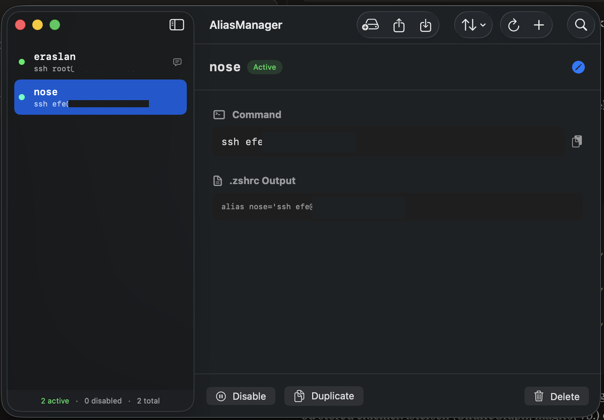

<div align="center">

# ⌨️ Terminal Alias Manager

**A native macOS app to visually manage your terminal aliases.**

No more manually editing `~/.zshrc` — add, edit, delete, tag and organize your shell aliases from a clean, native interface.

[](https://swift.org)
[](https://developer.apple.com/macos/)
[](https://developer.apple.com/xcode/swiftui/)
[](LICENSE)

</div>

---

## ✨ Features

### Core
| Feature | Description |
|---------|-------------|
| **Parse & List** | Automatically reads and parses aliases from `~/.zshrc` |
| **Add / Edit / Delete** | Full CRUD with validation and duplicate detection |
| **Enable / Disable** | Toggle aliases on or off without deleting them |
| **Search** | Instantly filter by alias name, command, description, or tags |
| **Sort** | Sort by name, command, status, most used, or recently used |
| **Duplicate** | Clone an existing alias with one click |
| **Auto Source** | Runs `source ~/.zshrc` after every change |
| **Backup** | Create timestamped backups of your `.zshrc` |
| **JSON Import / Export** | Share or migrate aliases between machines |
| **Native UI** | Built with SwiftUI + NavigationSplitView (Finder-style layout) |

### 🆕 New Features
| Feature | Description |
|---------|-------------|
| **Categories / Tags** | Tag aliases with `git`, `docker`, `ssh`... Sidebar tag filtering & chips in rows |
| **Menu Bar Widget** | Quick access from the menu bar — top aliases, copy commands, ⌘K |
| **Undo / Redo** | Full undo/redo stack for all changes — `⌘Z` / `⌘⇧Z` |
| **Usage Statistics** | Track how many times each alias was used, most used / never used views |
| **Alias Test Runner** | Run any alias command inline and see live output in the detail panel |
| **Quick Search ⌘K** | Spotlight-style floating search — find and copy any alias in 2 keystrokes |
| **Syntax Highlighting** | Command field highlights pipes `\|`, flags, `$ENV_VARS`, strings |
| **Theme Customization** | 10 accent colors, compact/normal/spacious density modes (`⌘,`) |
| **Alias Pack Templates** | One-click import of 5 curated packs: Git, Docker, Kubernetes, Node/npm, System |
| **Homebrew Cask** | `brew install --cask efekurucay/tap/alias-manager` |

---

## 🖥️ Screenshots

<p align="center">
  
</p>

<p align="center">
  
</p>

---

## 📋 Requirements

- **macOS 14.0** (Sonoma) or later
- **Xcode 15.2** or later
- **Swift 5.9**

---

## 🚀 Getting Started

### Option A — Build from source

```bash
git clone https://github.com/efekurucay/terminal-alias-manager.git
cd terminal-alias-manager
open AliasManager.xcodeproj
# Press ⌘R to build & run
```

### Option B — Homebrew (once the tap is published)

```bash
brew tap efekurucay/tap
brew install --cask alias-manager
```

---

## ⌨️ Keyboard Shortcuts

| Shortcut | Action |
|----------|--------|
| `⌘N` | Add new alias |
| `⌘K` | Quick Search (Spotlight-style) |
| `⌘Z` | Undo last change |
| `⌘⇧Z` | Redo |
| `⌘R` | Refresh alias list |
| `⌘,` | Open Settings (theme, menu bar) |
| `Esc` | Cancel / close form |

---

## 🏗️ Architecture

```
AliasManager/
├── AliasManagerApp.swift           ← App entry point, Settings scene
│
├── Models/
│   ├── AliasItem.swift             ← Alias data model (+tags, usageCount, lastUsed)
│   ├── MetadataStore.swift         ← Persists tags & stats (~/.config/alias-manager/)
│   ├── AppSettings.swift           ← Theme & appearance preferences (@AppStorage)
│   └── AliasPack.swift             ← 5 pre-built alias packs
│
├── Services/
│   ├── ZshrcService.swift          ← Read/write/parse ~/.zshrc
│   ├── CommandRunner.swift         ← Async zsh subprocess runner
│   └── MenuBarController.swift     ← NSStatusItem + aliases menu
│
├── ViewModels/
│   └── AliasViewModel.swift        ← Business logic, undo/redo, tag filtering, stats
│
└── Views/
    ├── ContentView.swift           ← Main screen + StatsView
    ├── AliasRowView.swift          ← Tag chips, usage badge, density-aware
    ├── AliasDetailView.swift       ← Detail panel + Test Runner + Tags
    ├── AliasFormView.swift         ← Add/Edit form + SyntaxHighlightedTextField + FlowLayout
    ├── QuickSearchView.swift       ← ⌘K Spotlight-style overlay
    ├── AliasPacksView.swift        ← Template pack browser
    └── SettingsView.swift          ← Accent color picker, density mode
```

---

## 🔧 How It Works

1. **On launch** — reads `~/.zshrc`, parses `alias name='command'` lines
2. **Metadata** — tags and usage stats are stored separately in `~/.config/alias-manager/metadata.json` (zshrc stays clean)
3. **On save** — rewrites only the managed alias block, runs `source ~/.zshrc`
4. **Test Runner** — spawns a `zsh -c "source ~/.zshrc; <command>"` subprocess, captures stdout/stderr

---

## 📦 Alias Packs

Import pre-built alias collections with one click from the toolbar (`Alias Packs`):

| Pack | Count | Description |
|------|-------|-------------|
| 🌿 **Git** | 17 | status, add, commit, push, branch, stash... |
| 🐳 **Docker** | 14 | ps, exec, logs, compose up/down... |
| ⚙️ **Kubernetes** | 12 | kubectl get/describe/logs/exec... |
| 📦 **Node / npm** | 13 | install, run dev/build/test, yarn... |
| 🖥️ **System** | 11 | ls, clear, reload, ip, ports... |

---

## 🤝 Contributing

1. Fork the repository
2. Create your feature branch (`git checkout -b feature/amazing-feature`)
3. Commit your changes
4. Push and open a Pull Request

---

## 📄 License

MIT License — see [LICENSE](LICENSE)

---

<div align="center">

Built with ❤️ using Swift & SwiftUI

[Report Bug](https://github.com/efekurucay/terminal-alias-manager/issues) · [Request Feature](https://github.com/efekurucay/terminal-alias-manager/issues)

</div>
